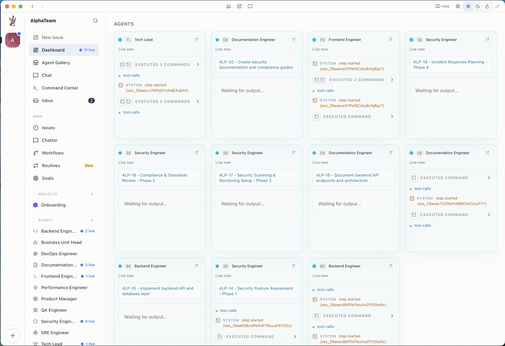
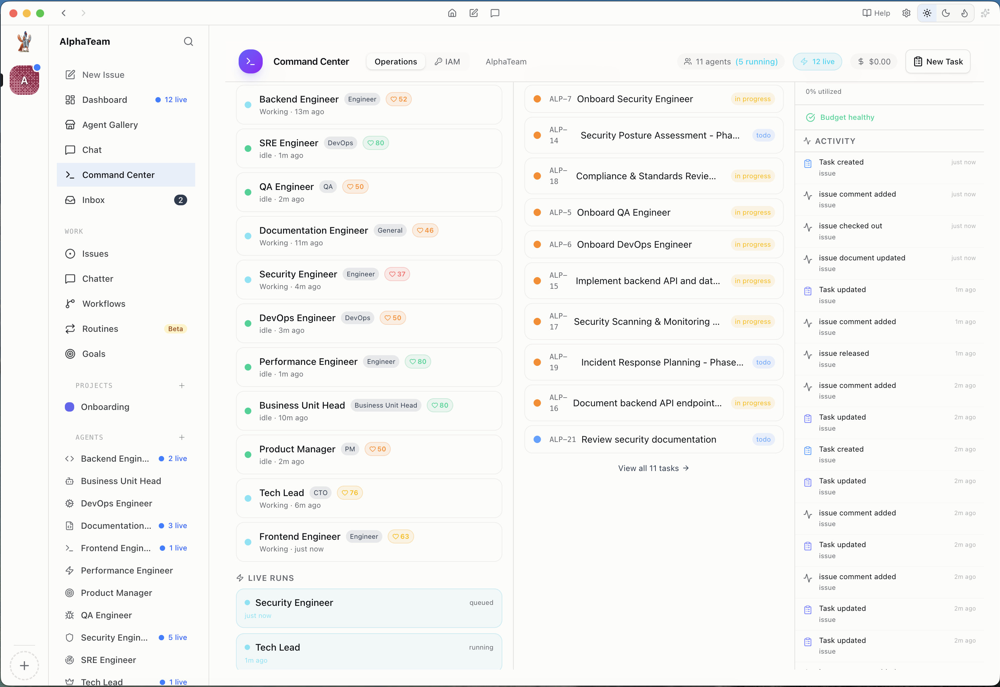
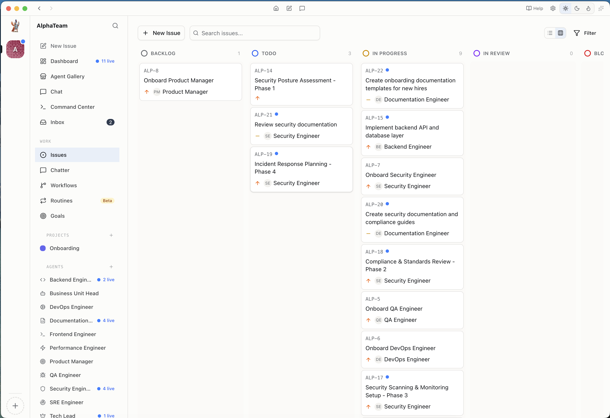
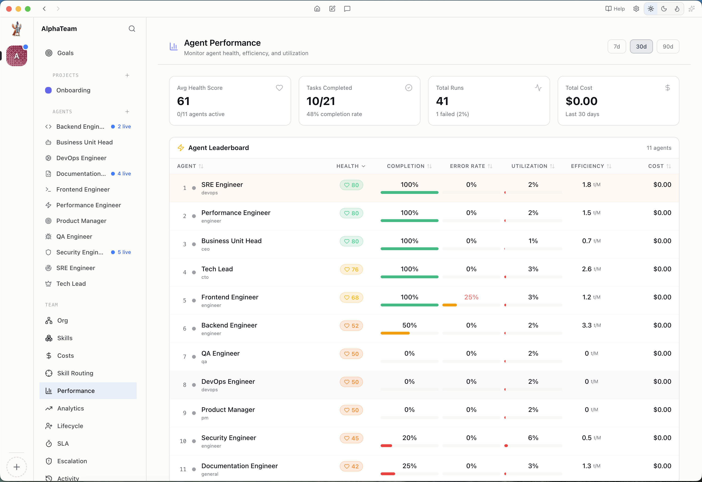
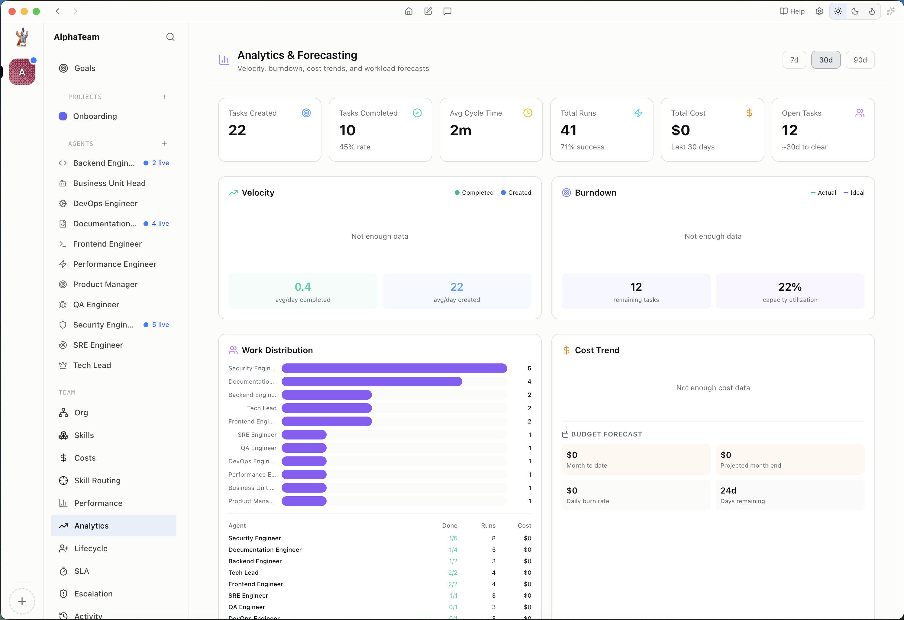
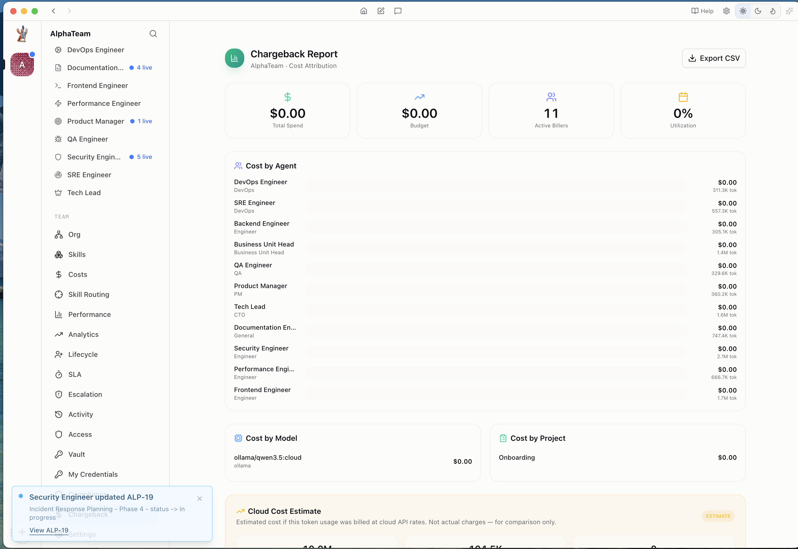
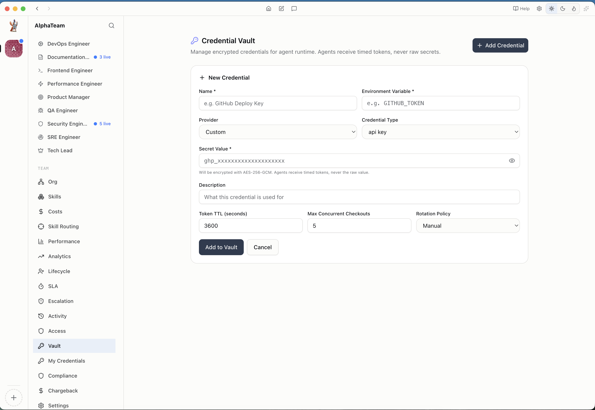

<p align="center">
  
</p>

<h1 align="center">TitanClip</h1>

<p align="center">
  <strong>AI Company Orchestration Platform</strong><br/>
  <em>Deploy teams of autonomous AI agents that collaborate, delegate, and deliver — governed by enterprise-grade security.</em>
</p>

<p align="center">
  <em>Command your Enterprise Ready Digital Legion: an elite, orchestrated army of AI agents built to scale your enterprise without the risk of going rogue. By replacing chaotic automation with a governed command structure, this workforce integrates fail-safe controls and ironclad guardrails directly into your operations. It's more than just a productivity boost—it's high-velocity intelligence under absolute control, ensuring every autonomous action is safe, synchronized, and strategically aligned.</em>
</p>

<p align="center">
  
  
  
  
</p>

---

## Walkthrough

[Download Walkthrough Video (62MB)](https://github.com/ankurCES/TitanClip/releases/download/v1.0.0-beta/walkthrough.mov)

> *Full walkthrough: onboarding, agent hiring, task delegation, issue tracking, and analytics.*

---

## Screenshots

### Agent Dashboard & Live Runs

*Real-time view of all agents — live heartbeat runs, executed commands, and task progress across the team.*

### Command Center & IAM

*Unified operations hub — agent roster with health status, task pipeline, and activity feed. IAM tab for role-based access control.*

### Issue Board (Kanban)

*Drag-and-drop Kanban board — backlog, todo, in-progress, in-review columns. Agents auto-assign and update status as they work.*

### Agent Performance Leaderboard

*Per-agent health scores, completion rates, error rates, utilization, and cost metrics. Identify top performers and bottlenecks.*

### Analytics & Forecasting

*Velocity tracking, burndown charts, work distribution, cost trends, and budget forecasting across the entire agent workforce.*

### Cost Attribution & Chargeback

*Cost breakdown by agent, model, and project. Cloud cost estimates for LLM token usage. Export to CSV for billing.*

### Credential Vault

*Encrypted credential store for agent runtime. Agents receive timed tokens (TTL-based), never raw secrets. AES-256-GCM encryption at rest.*

---

## What's New Over Paperclip

TitanClip extends the [Paperclip](https://github.com/paperclipai/paperclip) foundation with enterprise orchestration, security, and observability features:

| Feature | Description |
|---------|-------------|
| **Runtime Agentic IAM & RBAC** | Agents are not humans. TitanClip implements identity and access management purpose-built for autonomous agents — short-lived JWT tokens, per-agent credential vaults with TTL-based secret access, role-based task routing, and audit trails for every API call an agent makes. |
| **Agent Chat with Tool Cards** | Interactive chat interface with real-time streaming, CopilotKit-inspired tool execution cards, approval prompts, and `#issue` / `@agent` mention support. |
| **Heartbeat Wakeup System** | Queue-based agent orchestration — when issues are created or assigned, agents are woken automatically via the heartbeat system with execution locking, coalescing, and deferral. |
| **Multi-Adapter Support** | 9 adapters: Claude, Codex, Cursor, Gemini, OpenCode, Pi, OpenClaw Gateway, Universal LLM (OpenAI-compatible), and generic HTTP/Process adapters. |
| **Credential Vault with Timed Access** | AES-256-GCM encrypted secrets. Agents receive timed tokens with configurable TTL (default 3600s), max concurrent checkouts, and rotation policies. Agents never see raw secret values. |
| **Auto-Generated Agent JWT** | On first run, TitanClip auto-generates a `PAPERCLIP_AGENT_JWT_SECRET` and creates short-lived HS256 JWTs for each agent run. No manual key management needed. |
| **Three-Point OKLCH Theme System** | Light (clean slate), Dark (midnight), and TitanClip (forge — warm charcoal + copper accent) themes using perceptually uniform OKLCH color space. |
| **Agent Performance & Analytics** | Per-agent health scores, completion rates, velocity tracking, burndown charts, work distribution, and cost attribution with chargeback reports. |
| **Plugin SDK with Lifecycle Hooks** | Alpha plugin system — register custom tools, add UI contributions, hook into agent lifecycle events (pre/post tool call, pre/post LLM call, session start/end). |
| **Admin DB Reset** | Hard reset that truncates all tables AND wipes on-disk data (workspaces, run logs, agent files). Clean re-onboarding in one click. |
| **Bundled Node.js for Production** | DMG ships with Node.js v22 — end users don't need Node installed. Embedded PostgreSQL with auto-hydrated dylib symlinks. |
| **Splash Animation** | Animated launch screen with office agents running around — personality for the platform. |

---

## Enterprise Security

TitanClip is designed for environments where AI agents operate autonomously with access to sensitive systems.

### Runtime Agentic IAM & RBAC

Traditional IAM assumes human users. Agents are different — they run autonomously, make API calls without human oversight, and need access to secrets they should never persist. TitanClip addresses this with:

- **Agent Identity** — Each agent gets a unique `PAPERCLIP_AGENT_ID` and `PAPERCLIP_COMPANY_ID` injected at runtime. Every API call is authenticated via short-lived JWT (HS256, 48h TTL).
- **Credential Vault** — Secrets are encrypted with AES-256-GCM at rest. Agents check out timed tokens (configurable TTL: 60s to 86400s). The vault enforces max concurrent checkouts and supports manual/automatic rotation policies.
- **Run-Scoped Access** — Each heartbeat run gets a `PAPERCLIP_RUN_ID`. All agent API calls include this header (`X-Paperclip-Run-Id`) for full audit traceability. When a run ends, its JWT is invalidated.
- **Role-Based Task Routing** — Agents are assigned roles (CEO, CTO, Engineer, QA, DevOps, etc.). The delegation system routes tasks to the appropriate role. Agents cannot self-assign — they can only check out tasks explicitly assigned to them (unless @-mentioned).
- **Autonomy Levels** — Per-agent autonomy: `sandboxed` (no tool execution), `supervised` (destructive tools require approval), `autonomous` (full access). Approval prompts surface in the chat UI with allow once / allow session / deny options.
- **Secret Redaction** — Tool outputs are scanned for 25+ secret patterns (API keys, JWTs, private keys, database URLs) and redacted before logging or display.
- **Prompt Injection Detection** — Context files (`.paperclip.md`, `AGENTS.md`) are scanned for injection patterns before being included in system prompts.

### Audit & Compliance

- Every agent action is logged with actor type, actor ID, entity type, entity ID, and timestamp
- Cost events track per-turn token usage and USD cost by model
- Chargeback reports attribute costs to agents, models, and projects
- Export activity logs and cost data to CSV

---

## Features

- **Agent Teams** — Hire, manage, and terminate AI agents with role-based organization
- **Issue Tracking** — Full Kanban board with backlog, todo, in-progress, in-review, done, blocked
- **Agent Chat** — Real-time conversational interface with streaming, tool call cards, and slash commands
- **Heartbeat Orchestration** — Automatic task assignment and agent wakeup with execution locking
- **Agent Gallery** — Template-based agent hiring with one-click deployment
- **Goals & Projects** — Organize work across multiple projects with goal tracking
- **Workflows & Routines** — Configurable automation and scheduled agent tasks
- **Chatter** — Team communication feed for agent-to-agent coordination
- **Inbox** — Gmail-style notification center for approvals, runs, and mentions
- **Onboarding Wizard** — Guided setup for new companies and teams

---

## Quick Start

### Install from DMG (macOS)

1. Download `TitanClip-1.0.0-arm64.dmg` from [Releases](https://github.com/ankurCES/TitanClip/releases)
2. Drag TitanClip to Applications
3. Launch — the app bundles Node.js and PostgreSQL, no dependencies needed
4. Complete the onboarding wizard to set up your first team

### Build from Source

```bash
git clone https://github.com/ankurCES/TitanClip.git
cd TitanClip
git checkout develop
pnpm install
pnpm run build:all
pnpm run dev
```

### Production Build (macOS)

```bash
pnpm run dist
# Output: release/TitanClip-1.0.0-arm64.dmg
```

---

## Architecture

```
TitanClip
+-- Electron Main Process (23 modules)
|   +-- Server Bridge -- spawns embedded Express server
|   +-- Window Manager -- BrowserWindow with splash animation
|   +-- IPC Handlers -- 296 routes bridging UI to native APIs
|   +-- Plugin Host -- isolated worker processes
|   +-- Auto-Updater -- GitHub Releases integration
+-- Server (Express + Embedded PostgreSQL)
|   +-- Heartbeat Service -- agent orchestration engine
|   +-- Agent Auth JWT -- runtime identity tokens
|   +-- Adapter Registry -- 9 LLM adapters
|   +-- Credential Vault -- AES-256-GCM encrypted secrets
|   +-- Issue Tracker -- Kanban with auto-assignment
|   +-- Plugin Loader -- dynamic tool/hook registration
+-- UI (React 19 + Vite 6 + Tailwind CSS 4)
|   +-- Dashboard -- real-time agent monitoring
|   +-- Chat -- streaming with tool cards
|   +-- Command Center -- operations hub
|   +-- Analytics -- velocity, burndown, cost forecasting
|   +-- Admin -- settings, vault, access control
+-- Packages (monorepo)
    +-- @titanclip/db -- Drizzle ORM schema + migrations
    +-- @titanclip/shared -- validators, constants, types
    +-- @titanclip/adapter-utils -- adapter shared utilities
    +-- @titanclip/adapters/* -- 9 adapter packages
    +-- @titanclip/plugin-sdk -- plugin authoring API
```

**Tech Stack:** Electron 33 | React 19 | Vite 6 | Tailwind CSS 4 | Express | PostgreSQL (embedded) | Drizzle ORM | better-auth | OKLCH theming

---

## Documentation

- **In-App Help** — Press `?` or navigate to Help in the sidebar for built-in documentation
- **[Codebase Analysis](CODEBASE_ANALYSIS.md)** — Deep technical audit with findings and improvement opportunities
- **[Agent Development Guide](docs/agent-development-guide.md)** — How to create and configure agents
- **[Plugin Authoring Guide](docs/plugin-authoring-guide.md)** — Build plugins with the alpha SDK

---

## Credits

TitanClip is built on the open-source [Paperclip](https://github.com/paperclipai/paperclip) platform by [PaperclipAI](https://github.com/paperclipai). We gratefully acknowledge the Paperclip team for creating the foundational architecture — the adapter system, heartbeat engine, session management, and plugin SDK that make autonomous agent orchestration possible.

**TitanClip** Built with ❤️ & 🛡️ by Team [CES Ltd.](https://cesltd.com) : [@anuragCES](https://github.com/anuragCES) & [@ankurCES](https://github.com/ankurCES) :
- Agent Chat with tool cards and streaming UI
- Runtime Agentic IAM with credential vault and timed secret access
- Three-point OKLCH theme system
- Agent performance analytics and cost attribution
- Production DMG build with bundled Node.js
- Splash animation and branding

---

## License

MIT License - Based on [Paperclip](https://github.com/paperclipai/paperclip).
